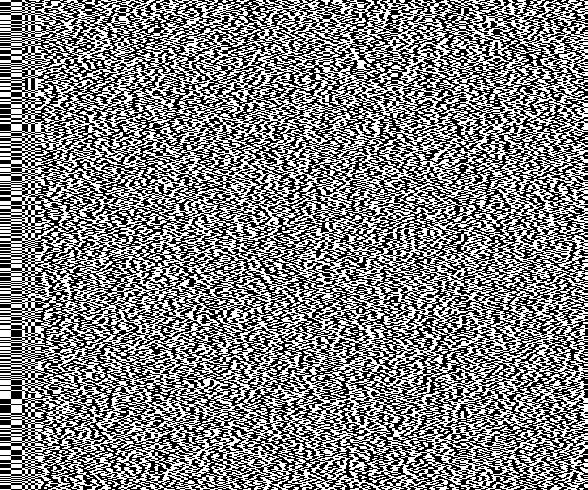

# How Compact Discs Work

### Oscilloscope images

### Raw data

Note that we do not now if the 0's correspond to 'lands' and the 1's to 'pits', or vice versa.
However, the first step of the signal processing is to alter the signal to look at places where the signal changes from
land-to-pit, or from pit-to-land, so this really doesn't make a difference.

### Delta signal

### Delta signal with frame structure

A frame consists of a SYNC pattern, a single 'sidechannel' byte, 12 bytes of audio data, 4 bytes of error correction data, 12 bytes of audio data, and another 4 bytes of error correction data.

All 33 bytes of data in a single frame are EFM encoded. The SYNC pattern and the 33 bytes (each encoded as 14 bits) are all followed by so-called 'merge' bits.

All this means that a single frame is encoded as 24 + 3 + 33 * (14 + 3) = 588 bits.

### Frames and sectors

