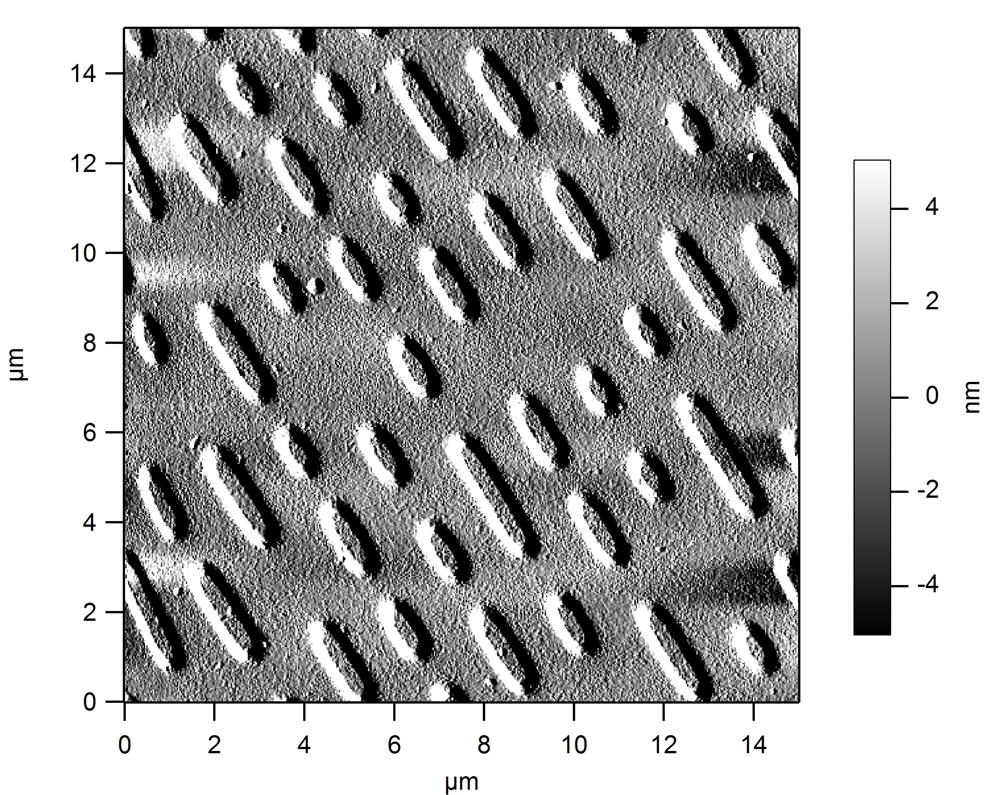
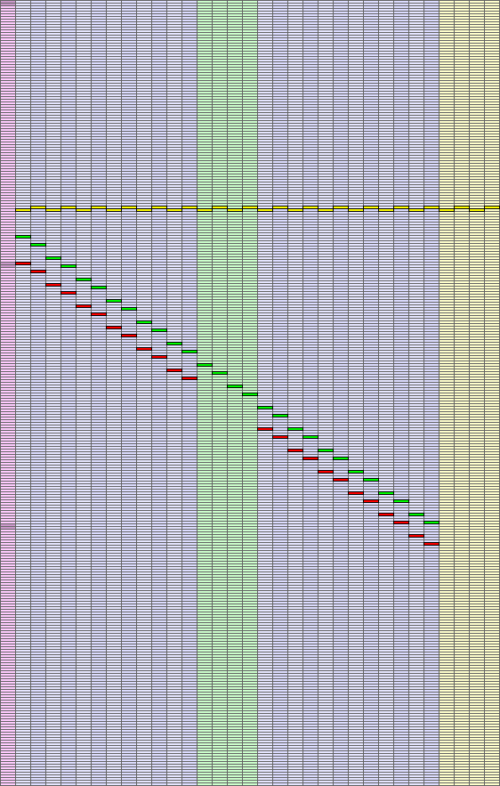

How Compact Discs Work
======================

This document explains the way data is stored on Compact Discs.

We will start by looking at the physical structure of the information-carrying
surface of a CD, where 'pits' and 'lands' are present that contain all of the
information.

From there, we will work our way up to the level where we can understand how
the information can be extracted from those structures: both the main audio
data and so-called 'subchannel' data, that allow the CD player to know the
track it is playing.

We will also explore the measures that have been taken to correct errors in
the readout process.

The surface of a CD
-------------------

The image below (courtesy of Wikimedia Commons user *freiermensch*) shows a
small part of the information-carrying surface of a Compact Disc. The
information on a CD is laid out in a long spiral-like track, which can be up
to 5 kilometers (just over 3 miles) long.

This is reminiscent of the way data is stored on an old gramophone record.
There are several key differences, though.

First, gramophone records are played back using a *constant angular velocity*
of 33, 45, or (for very old records) 78 revolutions per minute. As a
consequence, the quality of the playback is best when the needle is on the
outside of the record, where the needle travels faster along the groove.

CDs, on the other hand, are played back at a *constant linear velocity* of
about 1.4 meters per second. This means that a Compact Disc has to rotate
much faster when reading the information close to its center. Thanks to this,
the information density of as CD is the same everywhere along its track.

Second, CDs are read from the inside to the outside, rather than from the
outside to the inside. This makes it possible to handle different sizes
of CDs (e.g., regular CDs with a diameter of 120 mm CDs versus smaller CDs),
without changes to the mechanics; regardless of the size, the position
where playback begins is always the same. This is an improvement over
gramophone records, since there the starting position of the pick-up
element depended on the size of the record being played.

Third, and by far most important, is that the actual data on a CD is
*digital* rather than *analog*. This means that the actual information
is represented using a small set of readily distinguishable states.

In case of the CD, two distinguishable states are used: the 'lands' and
'pits' that the laser encounters while following a track. The precise height
of the lands and the pits isn't used to carry information; it's just the
fact that there is (or isn't) a pit at a certain place that matters, not how
deep it is. In contrast, in a gramophone record the sides of the track
followed by the needle are 'wavy', and the audio information is contained in
the precise shape of these wavy sides.

The Compact Disc is quite a feat of engineering, especially considering that
it was developed in the late 70s and early 80s. At the physical level, a CD
player has to be able to follow a microscopic track of lands and pits that
passes under its laser. This is a challenging control problem; if readind a
CD fails it is most often due to the inability of the CD player to follow the
track properly, with the consequence that the CD 'skips', and needs to restart
a search for the track.

Furthermore, it is necessary that the laser readout electronics can reliably
distinguish between lands and pits. This is actually the part that requires
a laser rather than a regular light source; the height difference between
the lands and pits is chosen to make sure that the reflected laser signal
exhibits either constructive or destructive interference, which can be
detected by an optical sensor. For this to work, it is necessary to precisely
focus the laser onto the surface of the CD, which is another challenging
control problem.

But let's assume for the moment that these challenges are met, and that the
CD player is able to track the spiral of lands and pits perfectly. The next
section discusses what the laser readout electronic 'sees' at that point.

The laser signal while playing the CD
-------------------------------------

Explain what an oscilloscope is.

Insert an analog-signal eye pattern image here.

Explain the eye pattern.

Analog electronics are used to turn the wavy signal in a real digital signal
with sharp edges.

Explain the T = 1/4321800 second 'base time'.

Pits and lands last for 3*T .. 11*T (nine different lengths).

Raw digital data
----------------

Turning an RF signal into reliable 0s and 1s is possible, but not trivial.

Note that we do not now for sure if the 0's correspond to 'lands' and
the 1's to 'pits', or vice versa.

The first step of the digital signal processing, as described below, is to
alter the signal to look at places where the signal changes from land-to-pit,
or from pit-to-land, so this really doesn't make a difference.

A Compact Disc with all lands turned into pits, and all pits turned in lands,
would play equally well.

Delta signal: only change matters
---------------------------------

Sync pattern becomes very very clear here.

The CD player knows where to sample by looking at when transitions tend to
happen ("clock recovery").

Frame structure
---------------

A frame consists of a SYNC pattern, a single 'sidechannel' byte, 12 bytes of audio data, 4 bytes of error correction data, 12 bytes of audio data, and another 4 bytes of error correction data.

All 33 bytes of data in a single frame are EFM encoded. The SYNC pattern and the 33 bytes (each encoded as 14 bits) are all followed by so-called 'merge' bits.

All this means that a single frame is encoded as 24 + 3 + 33 * (14 + 3) = 588 bits.

Sector structure
----------------

98 frames make up a sector.

Sync patterns

Subchannel information
----------------------

8 channels of information: P, Q, R, S, T, U, V, W

Only P and Q are normally used, the others are zeroes.

The alignment problem.

Audio data and audio data error correction
------------------------------------------

References
----------

Red Book
ECMA-130
